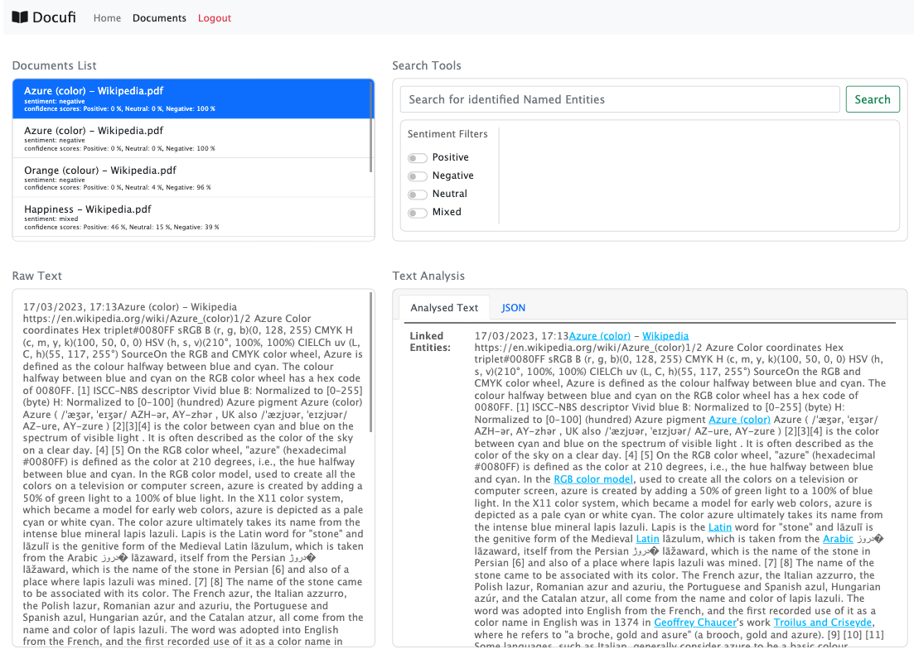

# Docufi

Docufi is a Node / Express JS Single Page application that allows users to upload, store and analyse PDF documents. Utilising the Text Analytics API (a feature from Microsoft Azure Cognitive Services) Docufi will mine the unstructured text and identify key phrases, entities, and sentiment. This allows you to better understand common topics and trends without having to read through all the text. Upload your PDFs for processing and gain a deeper understanding of your documents.

# Setup

## Clone the Repo

>`git clone git@github.com:vjohndo/docufi.git`

## Install Dependencies

Node.js is required to run this app locally. 

To install the dependencies, run this from the project directory\

>`npm install`

## Environment Variables

Create an environment file named .env and add the following:

>NODE_ENV=production\
ENDPOINT=Your AZURE end point here\
TEXT_ANALYTICS_API_KEY=Your AZURE key here\
EXPRESS_SESSION_SECRET_KEY=Your secret key here\
DB_USER=yourDbUser\
DB_PASSWORD=yourDbPassword\
DB_HOST=dbhost\
DB_NAME=shouldbeDocufi

## Configure Database

Create your postgres database and name it docufi:
>`createdb docufi`

Run schema.sql against your 'docufi' database to create tables

## Azure Cognitive Services

This application uses Microsoft Azures Cognitive Services. You will need to create a Cognitive Services resource using the Azure Portal (a free account can be created). 

Follow a guide [here](https://docs.microsoft.com/en-us/azure/cognitive-services/cognitive-services-apis-create-account?tabs=multiservice%2Cwindows) to create a cognitive services resource

## Socket.io for local development

In the client folder initialize.js needs 

>const socket = io("http://localhost:3000"); // if developing locally, comment out the other socket io
>const socket = io("https://docufi-app.herokuapp.com/"); // for production add in the endpoint, comment out the other socket io

## Technologies used
- Node.js
- Express
- Microsoft Azure Cognitive Services - Text Analysis
- Postgres SQL
- Bootstrap
- Socket.io

## Features
- Multiple file uploading
- User logins / Sign up
- NLP Results
- Socket.io for server > client notifications

## Potential future updates
- Expand the search capability to permit filtering by other entity types
- Cloud storage for files (Azure Blob Storage)

## Deployment Pipeline

Previously we've deployed this app to an Azure App Service which enables continuous deployment from Github. 
The build workflow for our azure app service public instance is initiated by pushing the `deploy/azure` branch. 

# Contributors
- [@upp22](https://github.com/upp22) (Shaunn Diamond)
- [@vjohndo](https://github.com/vjohndo) (John Do)
